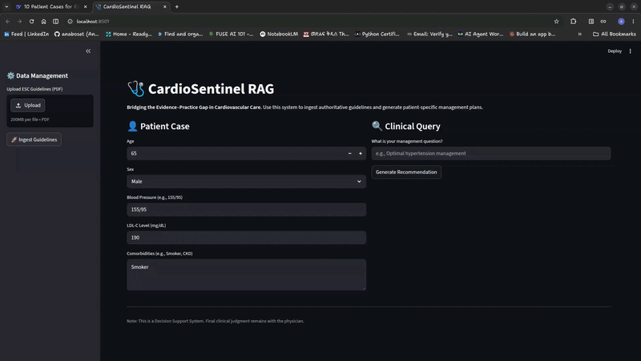

# CardioSentinel RAG

## 🩺 Overview

**CardioSentinel RAG** is a Retrieval-Augmented Generation (RAG) clinical decision support engine that transforms static cardiovascular disease management guidelines into a structured, queryable medical knowledge system. By combining semantic search (vector) + keyword retrieval (BM25) and evidence-constrained generation, it delivers patient-specific recommendations grounded strictly in authoritative guidelines.

The project addresses critical barriers in clinical practice: **Guideline Overload** and **Lack of Guideline Awareness**.

---



---

## 🚀 Key Features

**Hybrid Recall Engine:** Dual-stream retrieval using **ChromaDB** (semantic similarity) and **BM25 keyword search**.

**Multi-Query Expansion:** Automatically generates medical variants of a query to ensure that different clinical terminologies (e.g., "MI" vs. "Myocardial Infarction") all trigger relevant results.

**Context-Aware Reranking:** Filters hundreds of potential guideline chunks down to the top 5 most clinically relevant snippets using cross-attention.

**Modular Architecture:** Strict separation of Query Rewriting, Retrieval, and Generation logic for high maintainability.

**Clinical Guardrails:** Abstention mechanism to prevent hallucinations when guidelines do not cover a specific patient scenario.

---

## 🛡️ Safety & Transparency

* **Citations:** Every recommendation is accompanied by explicit citations to source guidelines.
* **Human-in-the-loop:** The system is designed for decision support, not autonomous decision-making.

---

## 🛠️ Technical Implementation

The system follows a 4-layer clinical RAG pipeline:

1. **Ingestion Layer**  
   Standardized guideline PDFs are parsed, cleaned, and split into overlapping chunks to preserve medical context.

2. **Hybrid Retrieval Layer**  
   - **Vector Search (ChromaDB):** Finds semantically similar guideline text  
   - **Keyword Search (BM25):** Improves recall using term overlap  

3. **Context-Aware Reranking Layer**  
   Retrieved candidates are scored against the patient summary to select the most clinically relevant evidence.

4. **Evidence-Constrained Generation Layer**  
   A guardrailed LLM synthesizes recommendations strictly from retrieved evidence and includes citations. If evidence is insufficient, the system abstains.

---

## ⚖️ Framework Tradeoffs & Choices

| Component | Choice | Reason for Choice |
| --- | --- | --- |
| **Vector Store** | **ChromaDB** | Lightweight, persistent, and supports the metadata filtering required for guideline recency (publication year). |
| **Reranker** | **Cohere v3.0** | Specifically trained for "long-context" document relevance, outperforming standard cosine similarity for dense medical text. |
| **Hosting Engine** | **Ollama** | Local model hosting reduces data exposure and improves privacy control and No API cost |
| **Embedder** | **nomic-embed-text** | 8k context window and high performance on medical benchmarks. |
| **Memory** | **Stateless (None)** | Intentionally omitted to prioritize clinical safety and data integrity(see below)


---


**⚠️ The Decision for Statelessness (No Memory)**

While conversational memory (Chat History) is common in RAG systems, CardioCDSS is designed as a **Stateless** tool to mitigate high-risk medical errors:

**- Preventing Context Pollution:** Memory poses a risk where data from "Patient A" might persist in the buffer when a clinician begins a query for "Patient B," leading to hallucinated, mixed-patient treatment plans.

**- Mitigating Guideline Drift:** Long-form conversations often cause LLMs to "drift" from their system instructions. Omitting memory ensures the model strictly adheres to the provided guideline context for every single query without the noise of previous exchanges.

**- Clinical Data Integrity:** Every recommendation is generated based solely on the current patient summary and retrieved evidence, ensuring a clean audit trail for every clinical decision.

---

## 🔍 How This Differs from Standard RAG

| Standard RAG | CardioCDSS |
|-------------|------------|
| Text similarity only | Vector + BM25 keyword retrieval |
| Free-form generation | Evidence-constrained output |
| Conversational memory | Stateless for clinical safety |


---

## 📂 Project Structure

```text
config/
├── config.yaml         # Global settings (Model names, chunk sizes, DB URIs)
├── prompts.yaml        # Centralized YAML for version-controlling LLM instructions
data/
├── guidelines/         # Input directory for authoritative ESC/ACC PDF guidelines
├── patient_cases/      # JSON/CSV repository of structured patient summaries
prompts/
├── recommendation.txt   # Prompt for clinical synthesis & strength of recommendation
├── system_cdss.txt      # Core system identity and medical safety guardrails
src/
├── ingestion/
│   └── loader.py        # PDF processing, chunking, and vector/BM25 ingestion
├── generation/
│   ├── rewriter.py      # Multi-query variant generation (Recall booster)
│   ├── generator.py     # LCEL chain logic for guideline-based response synthesis
│   └── pipeline.py      # The Orchestrator (Coordinates the Hybrid RAG flow)
├── retrieval/
│   └── retriever.py     # Singleton manager for ChromaDB and BM25
└── utils/
│    ├── logger.py        # Centralized logging with trace decorators
│    └── config_loader.py # Configuration and prompt management
tests/
│    ├── test_generator.py      # Unit tests for clinical response faithfulness 
│    ├── test_loader.py         # Validation for PDF chunking and metadata enrichment
│    ├── test_rag_pipeline.py   # End-to-end integration tests for the Hybrid RAG flow
│    └── test_rewriter.py       # Evaluation for query expansion and medical terminology
├── vectorstore/
├── .env.example
├── app.py                # Streamlit web interface for clinical consultation
├── main.py               # Command-line interface for developer testing
├── README.md
├── requirements.txt

```
---

## 📥 Installation & Setup

### 0. Prerequisites


### 1. Clone the Repository
Clone the project repository to your local machine.

```bash
git clone https://github.com/anaboset/cardiosentinel_rag
cd cardiosentinel_rag
```

### 2. Environment & Dependency Management

Using **Conda** or **venv** is recommended to isolate medical libraries.

**Windows:**

```powershell
python -m venv venv
.\venv\Scripts\activate
pip install -r requirements.txt

```

**Linux / Mac:**

```bash
python3 -m venv venv
source venv/bin/activate
pip install -r requirements.txt

```

### 3. Configuration (.env)

Create a `.env` file in the root directory:

```text
GROQ_API_KEY=your_key_here (or your choice of model)
COHERE_API_KEY=your_key_here
# Optional (only if you extend/re-enable graph ingestion):
# neo4j_uri=bolt://localhost:7687
# neo4j_username=neo4j
# neo4j_password=your_password

```
---

## 📖 Step-by-Step Usage Guide

You can run and use the app in two ways:

- Command line interface

- Streamlit UI

### Data Preparation
Before running either interface, you must have your medical evidence ready:

Action: Download clinical guidelines (PDF format).

    Note: Use authoritative documents for the best results (e.g., ESC 2025 Guidelines).

Need Guidelines? You can find authoritative documents here:

[American College of Cardiology (ACC)](https://www.acc.org/Guidelines)

[European Society of Cardiology (ESC)](https://www.escardio.org/Guidelines)

[World Health Organization (WHO)](https://www.who.int/southeastasia/activities/management-of-cardiovascular-disease)

### Option A: User-Friendly Web Interface (Streamlit)
Best for a visual, button-click experience.

**Launch the App:** Open your terminal and run:

```Bash
streamlit run app.py
```
**Upload Documents:** Use the Upload button on the sidebar to select your guideline PDFs.

**Process Knowledge:** Click the ingestion button and wait for the success message (this builds your Vector Store and BM25 keyword index).

**Consult:** Once complete, enter the Patient Summary and your Clinical Question in the chat box to get a recommendation.

### Option B: Interactive Command Line (CLI)
Best for fast, text-based interaction.

    Place your clinical guidelines in the data/guidelines folder.

**Ingest Data:** Process your guidelines into the system by running:

```Bash
python -m src.ingestion.loader
```
(You will see a progress bar as the AI "reads" your PDFs).

**Start the Assistant:** Launch the interactive chat:

```Bash
python main.py
```
Follow the Prompts: The system will ask you to:

👤 Enter Patient Summary (e.g., "65yo Male, Smoker, BP 155/95")

🔍 Enter your Clinical Question (e.g., "What is the first-line treatment?")

---

## 🧩 System Scope

CardioCDSS provides evidence retrieval and synthesis only.  
It does not:

- Interpret imaging
- Access real EHR systems
- Make autonomous treatment decisions

---

## ⚠️ Known Limitations

- Performance depends on quality and recency of guidelines ingested
- Does not resolve conflicting guideline recommendations
- Cannot reason beyond retrieved evidence

---

## 🧪 Evaluation Plan

CardioCDSS is evaluated as a **clinical decision support system**, not a chatbot.  
Evaluation focuses on evidence alignment, retrieval performance, and safety behavior.

#### 1️⃣ Retrieval Performance
Measures whether the correct guideline evidence is found.

- **Recall@K** — Probability that the relevant guideline section appears in top-K retrieved chunks  
- **Hybrid Retrieval Contribution** — % of successful retrievals that relied on BM25 vs vector similarity

#### 2️⃣ Generation Faithfulness
Ensures outputs do not contradict retrieved evidence.

- **Faithfulness Score (RAGAS or LLM-based evaluation)**  
- **Contradiction Rate** — Frequency of statements unsupported by citations

#### 3️⃣ Citation Accuracy
Verifies that cited guideline sources actually contain the referenced recommendations.

- Manual clinical review  
- Automated citation-to-source matching

#### 4️⃣ Safety & Abstention Behavior
Tests system response when guidelines do not contain relevant evidence.

- **Abstention Accuracy** — Correctly saying “No relevant guideline found”  
- **Hallucination Rate** — Generating unsupported medical advice

#### 5️⃣ Latency
Clinical usability requires near-real-time performance.

- Target: **< 5 seconds** from query to response


---

## 📈 Success Metrics

To validate the system as a reliable CDSS:

1. **Faithfulness:** Does the answer contradict the retrieved guidelines?

2. **Citation Accuracy:** Are the sources cited (e.g., "ESC 2024") actually the ones containing the data?

3. **Recall @ K:** Does the multi-query retrieval successfully find the correct guideline 95% of the time?

---

## ⚠️ Medical Disclaimer

This software is intended for **research and decision-support purposes only**.
It is **not a medical device** and **not intended for diagnosis, treatment, or
clinical decision-making without qualified human oversight**.

All clinical decisions must be made by licensed healthcare professionals.
The authors assume no liability for clinical use of this system.

## 📜 License

Please see [LICENSE](LICENSE) for more information.

---
